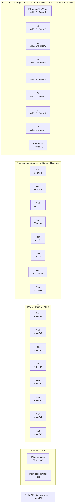

# Arturia MiniLab MkII → Renoise

Mapping déterministe : la config du clavier (MCC) et le fichier Renoise
(`.xrnm`) sont **les deux faces d'un même contrat**. On fige un preset
MCC selon le tableau ci-dessous, on charge le `.xrnm` correspondant —
aucune capture, aucune collision.

| Fichier | Rôle |
|---|---|
| `minilab_renoise.xrnm` | Mapping à charger dans Renoise (Load) |
| `layout.png` | Plan visuel |
| `README.md` | Ce document |
| `midi_dump.py` | Diagnostic : affiche ce qu'envoie chaque contrôle |
| `build_xrnm.py` | Construction/validation assistée (`--check` pour valider) |

## 1. Programmer le MiniLab (MIDI Control Center)

Tout sur **canal 1**, encodeurs en **Absolute**, pads en **Note/Gate**.
Puis **Store To** le MiniLab. ⚠️ **Ne plus changer de preset** : sur le
MiniLab, **Shift+Pad change de preset (1-8)** et réaffecte tous les
CC/notes → reste sur ce preset, n'utilise que le **bouton Pad bank**
(1-8 ↔ 9-16) pendant le jeu.

| Contrôle MiniLab | Type MCC | Canal | Numéro |
|---|---|---|---|
| Encodeurs 1-8 (normal) | Control / Absolute | 1 | CC 21-28 |
| Encodeurs 1-8 **+ Shift** | Control / Absolute | 1 | CC 31-38 |
| Push encodeur 1 | Switch / Gate | 1 | CC 113 |
| Push encodeur 9 | Switch / Gate | 1 | CC 115 |
| Pads banque 1 (1-8) | Note / Gate | 1 | Notes 36-43 |
| Pads banque 2 (9-16) | Note / Gate | 1 | Notes 44-51 |

## 2. Charger dans Renoise

Fenêtre **MIDI Mapping** → **Load** → `minilab_renoise.xrnm`.
(`Preferences → MIDI` : MiniLab activé en *In Device* ; MCC fermé.)

## Plan visuel

## Correspondance (34 mappings, 0 collision)

### Encodeurs — canal 1

| Encodeur | Normal (CC 21-28) | + Shift (CC 31-38) |
|---|---|---|
| 1 | Volume Track 1 | Param #01 du DSP sélectionné |
| 2 | Volume Track 2 | Param #02 |
| 3 | Volume Track 3 | Param #03 |
| 4 | Volume Track 4 | Param #04 |
| 5 | Volume Track 5 | Param #05 |
| 6 | Volume Track 6 | Param #06 |
| 7 | Volume Track 7 | Param #07 |
| 8 | Volume Track 8 | Param #08 |

### Push encodeurs

| Contrôle | CC | Fonction |
|---|---|---|
| Push 1 | 113 | Play / Stop (`Transport:Playback:Start/Stop Playing`) |
| Push 9 | 115 | Re-trigger pattern courant (`Seq. Triggering:Trigger:Current`) |

### Pads banque 1 — Navigation (Notes 36-43)

| Note | Fonction |
|---|---|
| 36 | ◀ Pattern (séquence précédente) |
| 37 | Pattern ▶ (séquence suivante) |
| 38 | ◀ Track |
| 39 | Track ▶ |
| 40 | ◀ DSP |
| 41 | DSP ▶ |
| 42 | Vue éditeur de pattern |
| 43 | Vue éditeur MIDI |

### Pads banque 2 — Mute (Notes 44-51)

Note 44→Mute Track 1 … Note 51→Mute Track 8.

## Workflow type

1. Pads bq1 : navigue (pattern → track → DSP).
2. Shift+encodeurs : règle les 8 paramètres du DSP sélectionné.
3. Encodeurs seuls : volumes ; Pads bq2 : mutes.
4. Push 1 : Play/Stop ; Push 9 : relance le pattern à la volée.

## En attente / extensions

- **Strip Pitch (gauche)** → bend de tempo (`Transport:Song:BPM [Set]`,
  retour auto au centre). Non inclus : le Pitch Bend n'est pas confirmé
  mappable dans ce format `.xrnm` — à mapper à la main via *Learn Mode*
  si désiré.
- **Strip Modulation (droite)** : non assigné (revient à 0 au relâché).
- Re-générer/valider : `python3 build_xrnm.py --check minilab_renoise.xrnm`.
