# Arturia MiniLab MkII → Renoise

Mapping clavier/contrôleur **Arturia MiniLab MkII** pour piloter Renoise :
navigation **pattern ↔ pattern**, **track ↔ track**, **DSP ↔ DSP**, et
volume des 8 premières pistes.

| Fichier | Rôle |
|---|---|
| `minilab_renoise.xrnm` | Mapping MIDI à charger dans Renoise |
| `layout.png` | Plan visuel (qui fait quoi sur le clavier) |
| `README.md` | Ce document |
| `midi_dump.py` | Script pour identifier ce qu'envoie chaque contrôle |
| `build_xrnm.py` | Construction assistée + validée du `.xrnm` (zéro saisie manuelle) |

## Construire le mapping sans se planter

`build_xrnm.py` supprime la transcription manuelle : il te demande
fonction par fonction d'actionner le bon contrôle, **capture le MIDI
réel**, te fait **confirmer**, détecte les **collisions** et **reprend**
la ligne en cas d'erreur, puis écrit le `.xrnm` et le **revalide**.

```bash
pip install mido python-rtmidi
python3 controllers/minilab-mkii/build_xrnm.py --port minilab --out controllers/minilab-mkii/minilab_renoise.xrnm
# revalider un fichier existant :
python3 controllers/minilab-mkii/build_xrnm.py --check controllers/minilab-mkii/minilab_renoise.xrnm
```

Cycle par ligne : actionne le contrôle → message capturé → `Entrée`=ok /
`r`=refaire / `s`=sauter. Toute collision (même canal+note/CC déjà pris)
force la reprise. En fin de course, rapport de validation (XML +
absence de conflit).

## Identifier les contrôles (pads 9-16, etc.)

Plutôt que le *Learn Mode* pad par pad, utilise le dumper :

```bash
pip install mido python-rtmidi      # ou : pip install -e ".[midi]"
python3 controllers/minilab-mkii/midi_dump.py                 # liste les ports
python3 controllers/minilab-mkii/midi_dump.py --port minilab  # écoute
```

Appuie/tourne chaque pad/knob : chaque message est décodé avec le
canal, la note/CC **et la ligne `.xrnm` correspondante** déjà formatée.
Le SysEx du bouton de banque s'affiche tagué « Arturia interne —
ignorer ». Copie-colle la sortie et envoie-la pour étendre le mapping.

## Installation

1. **Arturia MIDI Control Center** : charge un template *User/DAW*, pads
   et knobs en **CC/Notes fixes**, puis *Store To* le MiniLab. Ferme
   ensuite MCC (il verrouille le port USB, sinon Renoise ne reçoit rien).
2. **Renoise** → `Preferences → MIDI` : active le MiniLab dans un slot
   *In Device*.
3. Ouvre la fenêtre **MIDI Mapping** → bouton **Load** →
   `minilab_renoise.xrnm`.

## Plan visuel

```mermaid
flowchart TB
  subgraph ENC["Encodeurs rangee haute - Ch2, CC 21-28 (absolu)"]
    direction LR
    E1["1 - CC21<br/>Vol Track 1"]
    E2["2 - CC22<br/>Vol Track 2"]
    E3["3 - CC23<br/>Vol Track 3"]
    E4["4 - CC24<br/>Vol Track 4"]
    E5["5 - CC25<br/>Vol Track 5"]
    E6["6 - CC26<br/>Vol Track 6"]
    E7["7 - CC27<br/>Vol Track 7"]
    E8["8 - CC28<br/>Vol Track 8"]
  end
  subgraph PADS["Pads banque 1 - Navigation"]
    direction TB
    subgraph PR1["Rangee haute"]
      direction LR
      P1["Pad1 CC52 Ch2<br/>&#9664; Pattern"]
      P2["Pad2 n37 Ch10<br/>Pattern &#9654;"]
      P3["Pad3 n38 Ch10<br/>&#9664; Track"]
      P4["Pad4 n39 Ch10<br/>Track &#9654;"]
    end
    subgraph PR2["Rangee basse"]
      direction LR
      P5["Pad5 n40 Ch10<br/>&#9664; DSP"]
      P6["Pad6 n41 Ch10<br/>DSP &#9654;"]
      P7["Pad7 n42 Ch10<br/>Vue Pattern"]
      P8["Pad8 n43 Ch10<br/>Vue MIDI"]
    end
  end
  ENC ~~~ PADS
```




## Tableau de correspondance

### Encodeurs (rangée haute) — MIDI canal 2, CC absolu

| Encodeur | CC | Fonction Renoise |
|---|---|---|
| 1 | 21 | Volume Track 1 |
| 2 | 22 | Volume Track 2 |
| 3 | 23 | Volume Track 3 |
| 4 | 24 | Volume Track 4 |
| 5 | 25 | Volume Track 5 |
| 6 | 26 | Volume Track 6 |
| 7 | 27 | Volume Track 7 |
| 8 | 28 | Volume Track 8 |

### Pads banque 1 — Navigation (valeurs capturées sur le MiniLab)

| Pad | Envoie | Fonction Renoise |
|---|---|---|
| 1 | CC 52 · Ch2 | ◀ Pattern précédent (`Navigation:Sequencer:Select Previous Sequence Pos`) |
| 2 | Note 37 · Ch10 | Pattern suivant ▶ (`…Select Next Sequence Pos`) |
| 3 | Note 38 · Ch10 | ◀ Track précédente (`Navigation:Tracks:Select Previous Track`) |
| 4 | Note 39 · Ch10 | Track suivante ▶ (`…Select Next Track`) |
| 5 | Note 40 · Ch10 | ◀ DSP précédent (`Navigation:Track DSPs:Select Previous Track DSP`) |
| 6 | Note 41 · Ch10 | DSP suivant ▶ (`…Select Next Track DSP`) |
| 7 | Note 42 · Ch10 | Vue éditeur de pattern (`GUI:Middle Frame:Show Pattern Editor`) |
| 8 | Note 43 · Ch10 | Vue éditeur MIDI (`GUI:Middle Frame:Show Instrument Midi Editor`) |

> Pad 1 envoie du CC (et non une note) sur ce preset — sans importance,
> Renoise le mappe pareil. Les valeurs ci-dessus sont **celles réellement
> émises par ton MiniLab**, capturées par `build_xrnm.py` (zéro saisie
> manuelle, fichier revalidé : 0 collision).

### Pads banque 2 (Mute) — NON inclus

Sur ce preset, les pads 9-16 envoient les **mêmes CC que les knobs de
volume** (CC 23-28, Ch2) → conflit irrésolvable côté Renoise. Ils sont
donc **volontairement exclus** du fichier. Pour les ajouter (Mute/Solo,
transport…), il faut d'abord leur donner des numéros distincts **dans
MIDI Control Center** : sélectionne les pads de la banque 9-16, mets-les
en **Note, Channel 10, notes 44-51, mode Gate**, *Store To*, puis
relance `build_xrnm.py`.

## Notes importantes

- **Canaux** : dans le fichier `.xrnm`, `<Channel>` est *0-based* →
  `1` s'affiche **Ch2** dans Renoise, `9` s'affiche **Ch10**. Les
  encodeurs sont sur le canal 2, les pads sur le canal 10 (valeurs
  relevées sur tes propres captures, donc cohérentes avec ton MiniLab).
- **Si un pad ne réagit pas** : relance `build_xrnm.py` (il recapture
  les valeurs réelles et revalide) plutôt que d'éditer à la main.
- **« Pattern précédent/suivant »** = avancer/reculer dans la **séquence
  du morceau** (l'arrangement). Pour changer *quel* pattern occupe le
  slot courant, ce sont d'autres actions
  (`Navigation:Sequencer:Increase/Decrease Current Pattern`).
- Une action `[Trigger]` se déclenche au coup de pad ; mets les pads en
  **Gate** ou **Trigger** côté MCC (pas Toggle) pour ces fonctions.

## Extensions possibles

- 2ᵉ banque d'encodeurs → volume tracks 9-16, ou paramètres du **DSP
  sélectionné** (clic droit sur un paramètre d'effet → *Set MIDI
  Mapping* → tourne le knob).
- 2ᵉ banque de pads → Mute/Solo, transport, Loop : possible une fois
  les pads 9-16 réassignés dans MCC (voir « Pads banque 2 » ci-dessus),
  puis `build_xrnm.py`.
- Paramètres du **DSP sélectionné** au knob : nécessite les libellés
  d'action de `Navigation ▸ Track DSPs` (capture d'écran du nœud déplié
  dans la fenêtre MIDI Mapping Renoise).
